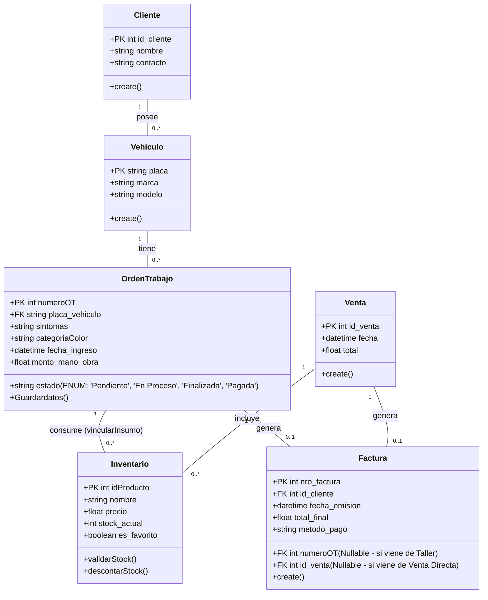

# README.md - Especificación Técnica del Modelo de Datos (ERD)

**Proyecto:** Sistema de Gestión Electromecánica JP
**Destinatario:** Modelador de Base de Datos / Arquitecto de Datos
**Fecha:** 25/01/2026

---

## 1. Objetivo

Diseñar el Modelo Entidad-Relación (DER) físico para el sistema, basándose estrictamente en los diagramas de secuencia aprobados y el diagrama de clases resultante. El objetivo es persistir la información crítica de los flujos de "Entrada", "Taller", "Venta" y "Facturación".

## 2. Instrucciones Generales para el Modelador

El diagrama de clases proporcionado abajo sigue un patrón **MVC**. Para la base de datos, debes aplicar el siguiente filtro:

1. **IGNORAR Vistas (Boundaries):** No crear tablas para `FormularioEntrada`, `PanelKiosco`, `ModuloVenta`, `PanelLiquidacion`. Estas son interfaces de usuario.
2. **IGNORAR Controladores (Gestores):** No crear tablas para `GestorRegistro`, `GestorTaller`, `GestorInventario`, `GestorFacturacion`. Esta es lógica de negocio en el backend.
3. **CONVERTIR Entidades:** Debes crear tablas obligatorias para las clases del **Bloque 3** (`Vehiculo`, `Cliente`, `OrdenTrabajo`, `Inventario`, `Venta`, `Factura`).

---

## 3. Diagrama de Clases de Referencia (Fuente de Verdad)

Utiliza el siguiente código Mermaid para visualizar la estructura de clases y sus atributos requeridos.

---

## 4. Requerimientos Específicos por Tabla

Por favor, asegúrate de incluir los siguientes campos y restricciones derivados de los mensajes de los diagramas de secuencia:

### A. Tabla `OrdenTrabajo` (Tabla Principal)

* **Estados:** El campo `estado` es vital. Los valores deben soportar las transiciones vistas en los diagramas:
* `"Pendiente"` (Al crear en Recepción).
* `"En Proceso"` (Al iniciar servicio en `GestorTaller`).
* `"Finalizada"` (Al terminar trabajo técnico).
* `"Pagada/Cerrada"` (Al facturar).

* **Prioridad:** Incluir campo `categoriaColor` (usado para resaltar express).
* **Costos:** Debe permitir separar `monto_mano_obra` (ingresado en liquidación) del costo de repuestos.

### B. Tabla `Inventario` (o Productos)

* Debe tener un campo booleano o flag para `Favoritos` (según el método `consultarFavoritos()` del Kiosco).
* Debe manejar control de concurrencia para el campo `stock` (métodos `validarStock` y `descontarStock`).

### C. Tablas Intermedias (Crucial)

Aunque no aparecen como "Cajas" en el diagrama de secuencia, las acciones **`vincularInsumo`** y **`agregarAlCarrito`** implican obligatoriamente la creación de tablas de detalle:

1. **`Orden_Detalle_Repuesto`**:
* `FK_OrdenTrabajo`
* `FK_Producto`
* `Cantidad`
* `Precio_Al_Momento` (Snapshot del precio).

2. **`Venta_Detalle`** (Para venta de mostrador):
* `FK_Venta`
* `FK_Producto`
* `Cantidad`

### D. Tabla `Factura`

* Debe ser capaz de vincularse a una `OrdenTrabajo` (Servicio) **O** a una `Venta` (Mostrador).
* Atributos necesarios: `fecha`, `total`, `metodo_pago`.

---

## 5. Entregables

1. Diagrama ER (Entidad-Relación) en formato imagen o PDF.
2. Script SQL de creación de tablas (`CREATE TABLE`) incluyendo:
* Primary Keys (PK).
* Foreign Keys (FK).
* Tipos de datos correctos (INT, VARCHAR, DECIMAL, DATETIME).

**Nota Final:** Ante cualquier duda sobre la cardinalidad, asumir la estructura estándar de un sistema de taller (Un Cliente -> Muchos Autos -> Muchas Órdenes).